<div align="center">

# Claude Editorial LaTeX

**El kit LaTeX para tu diario de trabajo y los borradores de tus papers
académicos — con la calidez editorial de Claude.**

Plantilla pública para investigadores, ingenieros y científicos que escriben
papers, ADRs, runbooks, informes y notas diarias en PDF. Tipografía serif para
autoridad, paleta cálida con disciplina (pergamino · marfil · terracota),
componentes para decisiones, riesgos, KPI, código, UML/ER, theorems,
demostraciones y bibliografía. Compila igual en MiKTeX, TeX Live, MacTeX y
**Overleaf**.

[](LICENSE)
[](#requisitos)
[](latexmkrc)
[](#overleaf)
[](#proyecto-no-oficial)
[](#dependencias-latex)

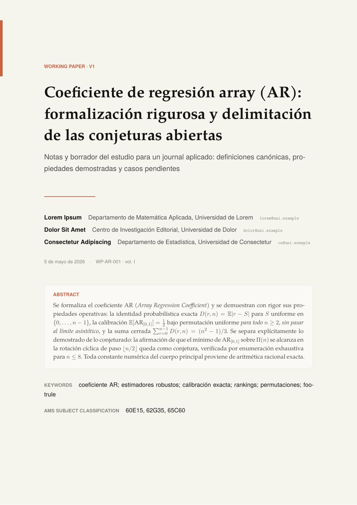

</div>

---

## Tabla de contenidos

- [¿Qué es esto?](#qué-es-esto)
- [Galería](#galería)
- [Paper académico](#paper-académico)
- [Obras del autor publicadas](#obras-del-autor-publicadas)
- [Inicio rápido](#inicio-rápido)
- [Overleaf](#overleaf)
- [Estructura del repositorio](#estructura-del-repositorio)
- [Requisitos](#requisitos)
- [Compilar los ejemplos](#compilar-los-ejemplos)
- [Anatomía de un documento](#anatomía-de-un-documento)
- [Catálogo de componentes](#catálogo-de-componentes)
- [Soporte matemático y paper cover](#soporte-matemático-y-paper-cover)
- [Personalizar metadatos](#personalizar-metadatos)
- [Sistema de tokens](#sistema-de-tokens)
- [Principios de diseño](#principios-de-diseño)
- [Documentación adicional](#documentación-adicional)
- [Solución de problemas](#solución-de-problemas)
- [Contribuir](#contribuir)
- [Licencia](#licencia)
- [Proyecto no oficial](#proyecto-no-oficial)

## ¿Qué es esto?

`claudeeditorial.cls` es una clase LaTeX autocontenida y de **dominio público**
que provee un sistema visual completo para producir PDFs editoriales:

- **Portada editorial** con kicker, título display, subtítulo, autor y referencia.
- **Páginas de capítulo** con marcador circular terracota y banda lateral.
- **Cabecera operativa de proyecto** con campos de fecha, fase, estado y dueño.
- **Tarjetas KPI / BigStat** para indicadores ejecutivos.
- **Registros de decisión** (ADR) con contexto, decisión, consecuencia y estado.
- **Tablas de riesgos** con columnas semánticas y badges de estado.
- **Bloques de código** con numeración y resaltado nativo para SQL, JavaScript,
  TypeScript, JSON, CSS, HTML, XML, VBA, Java, C/C++/C#.
- **Diagramas UML** (clases, interfaces, herencia, dependencia) y **ER**
  (entidades, atributos, relaciones, cardinalidad pata de cuervo) sin paquetes
  externos: TikZ puro con licencia limpia.
- **Cajas semánticas** (`Info`, `Tip`, `Warning`, `Critical`, `Check`, `Question`)
  para guiar la lectura sin convertirse en decoración.
- **Compatibilidad Pandoc**: tokens `Highlighting`/`Shaded` definidos para
  renderizar la salida de `pandoc -t latex` directamente.

> No es una colección de paquetes vendorizados: las ideas de inspiración se
> tradujeron a macros originales con licencia permisiva. Ver
> [`docs/REFERENCE_MAP.md`](docs/REFERENCE_MAP.md).

## Galería

Capturas reales generadas por `xelatex` en MiKTeX. Los PDFs originales están en
[`docs/preview/pdf/`](docs/preview/pdf/) y se pueden descargar y abrir
directamente desde GitHub.

<table>
<tr>
<td width="50%" valign="top">
<a href="docs/preview/pdf/main.pdf">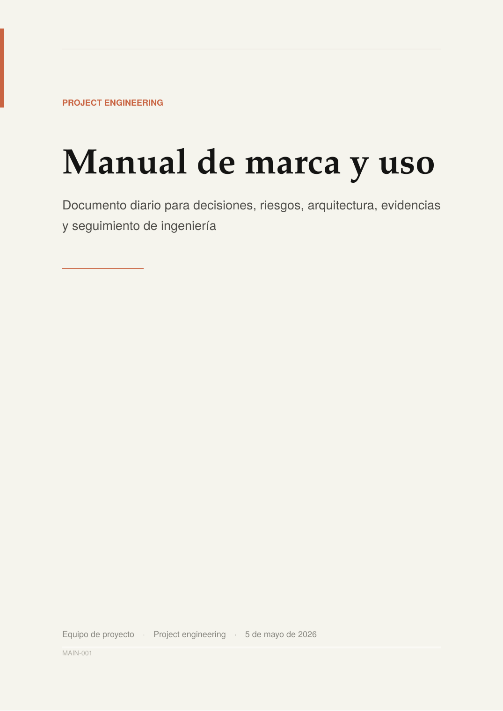</a>
<sub><b>main.tex · portada</b> — kicker, título serif display y franja terracota.
<a href="docs/preview/pdf/main.pdf">📄 PDF</a></sub>
</td>
<td width="50%" valign="top">
<a href="docs/preview/pdf/main.pdf">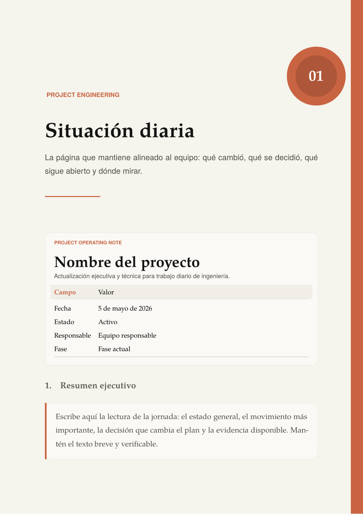</a>
<sub><b>main.tex · apertura</b> — marcador circular, cabecera de proyecto con
metadatos y resumen ejecutivo. <a href="docs/preview/pdf/main.pdf">📄 PDF</a></sub>
</td>
</tr>
<tr>
<td width="50%" valign="top">
<a href="docs/preview/pdf/main.pdf">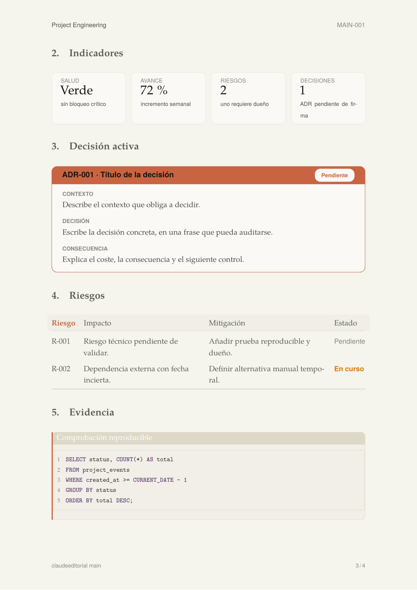</a>
<sub><b>main.tex · indicadores y decisión</b> — KPI cards, registro de decisión
ADR, tabla de riesgos con estados y bloque SQL numerado.
<a href="docs/preview/pdf/main.pdf">📄 PDF</a></sub>
</td>
<td width="50%" valign="top">
<a href="docs/preview/pdf/project-daybook.pdf">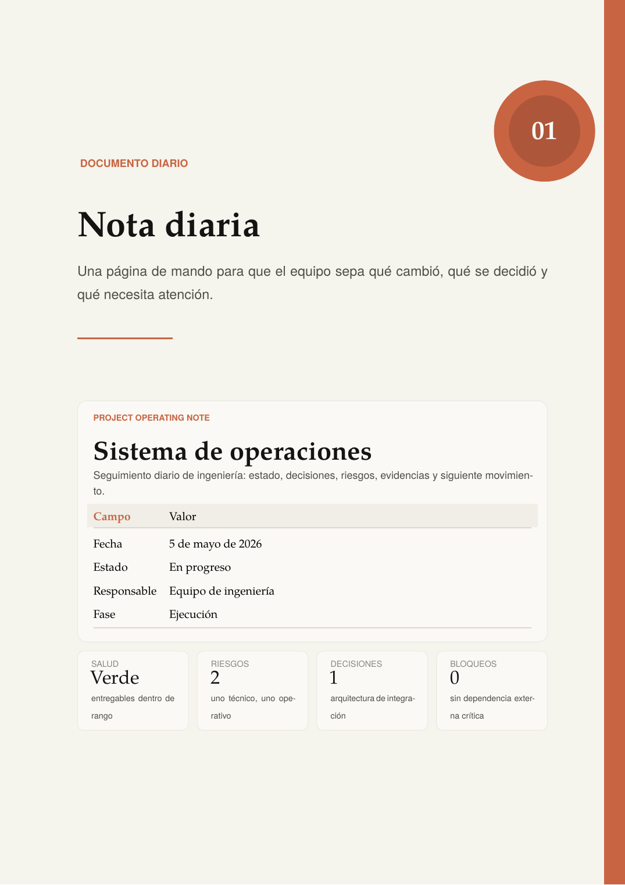</a>
<sub><b>project-daybook.tex</b> — diario operativo con marcador de capítulo,
cabecera de proyecto y panel de KPI.
<a href="docs/preview/pdf/project-daybook.pdf">📄 PDF</a></sub>
</td>
</tr>
<tr>
<td width="50%" valign="top">
<a href="docs/preview/pdf/technical-showcase.pdf">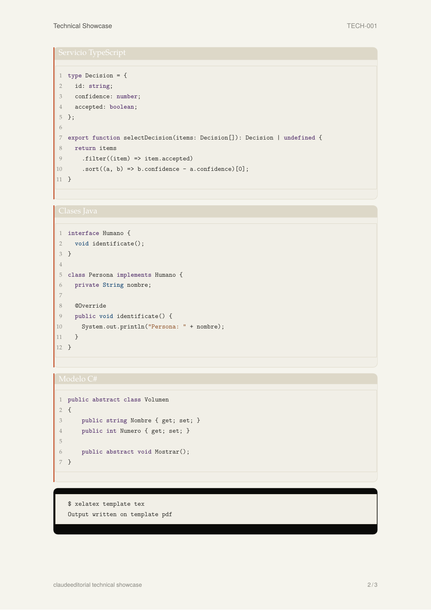</a>
<sub><b>technical-showcase.tex</b> — bloques de código numerados (TypeScript,
Java, C#) y caja de consola.
<a href="docs/preview/pdf/technical-showcase.pdf">📄 PDF</a></sub>
</td>
<td width="50%" valign="top">
<a href="docs/preview/pdf/lorem-all-cases.pdf">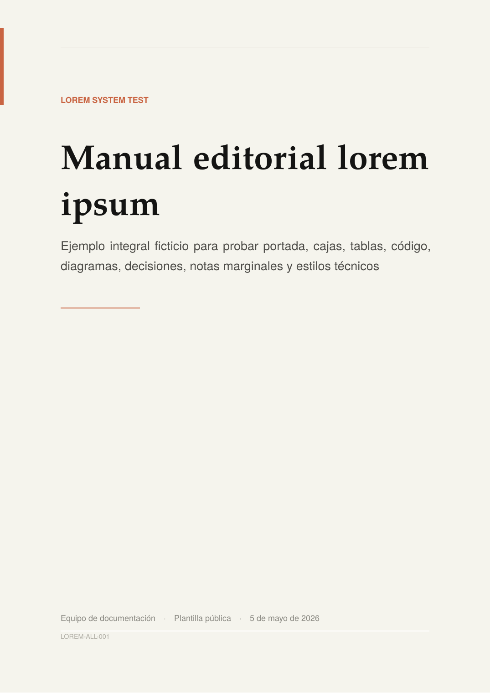</a>
<sub><b>lorem-all-cases.tex</b> — portada del ejemplo integral (14 páginas que
ejercitan casi todos los componentes).
<a href="docs/preview/pdf/lorem-all-cases.pdf">📄 PDF</a></sub>
</td>
</tr>
</table>

## Paper académico

`examples/research-paper.tex` es la pieza nueva: un borrador de **working
paper** con `\ClaudePaperCover`, abstract editorial, keywords, AMS subject
classification, autores con afiliación y email, y todo el aparato de
*theorems* (definition · proposition · theorem · corollary · lemma ·
remark · conjecture · note) en castellano e inglés compartiendo contador.
Las ecuaciones se numeran en terracota y `\cref` resuelve los enlaces
con prefijo automático.

<table>
<tr>
<td width="50%" valign="top">
<a href="docs/preview/pdf/research-paper.pdf"></a>
<sub><b>research-paper.tex · portada</b> — kicker, título, autores con
afiliación, abstract en bloque marfil, keywords y MSC.
<a href="docs/preview/pdf/research-paper.pdf">📄 PDF</a></sub>
</td>
<td width="50%" valign="top">
<a href="docs/preview/pdf/research-paper.pdf">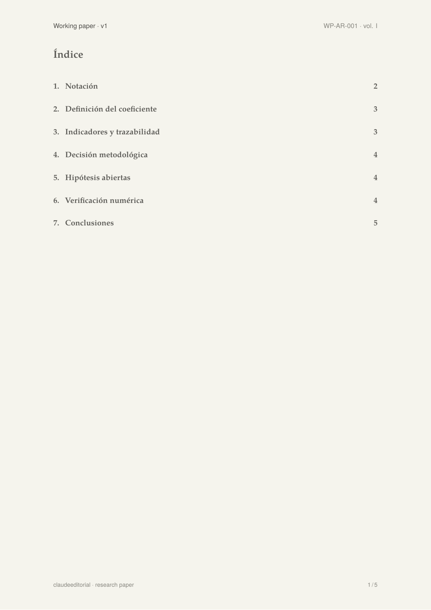</a>
<sub><b>research-paper.tex · cuerpo</b> — definiciones, proposiciones
y teoremas con demostración; ecuaciones numeradas en terracota.
<a href="docs/preview/pdf/research-paper.pdf">📄 PDF</a></sub>
</td>
</tr>
</table>

## Obras del autor publicadas

Siete trabajos del autor —ya publicados en LinkedIn— **portados al
sistema visual claudeeditorial**: misma clase, misma paleta cálida,
mismas cajas semánticas (`ClaudeInfo`, `ClaudeTip`, `ClaudeCheck`,
`ClaudeCard`, `ClaudeCode`), KPI cards y `\ClaudeChapterPage`. Son la
**prueba de campo de la plantilla con contenido real, no lorem
ipsum**: cada uno ejercita una combinación distinta de componentes
del kit.

| Obra | Componentes que ejercita | Páginas | PDF |
|---|---|---:|---|
| **La parte principal** | `\ClaudeCover` · 5×`\ClaudeChapterPage` (numeración romana) · `claudehero` con `gather*` matemático · `claudequote` para Salmos · `ClaudeTip` final. | 7 | [📄](docs/preview/pdf/la-parte-principal.pdf) |
| **Trazabilidad Juan Pedro** | `claudehero` ejecutivo · 8×`\ClaudeChapterPage` · 4×`\KPICard` · `ClaudeCard` con fórmula de pipeline · `ClaudeInfo`/`ClaudeTip`/`ClaudeCheck` · `ClaudeTable` para complejidad · `ClaudeDiagram` con TikZ y la paleta. | 10 | [📄](docs/preview/pdf/trazabilidad-juan-pedro.pdf) |
| **Interpolación y código** | 7×`\ClaudeChapterPage` · 4×`ClaudeCode[Python]` (búsqueda binaria, MixUp) · `ClaudeCard` para fórmulas · `ClaudeTable` lineal vs log-lineal · `ClaudeCheck` final. | 12 | [📄](docs/preview/pdf/interpolacion-codigo.pdf) |
| **EGARCH: del código a la fórmula** | 8×`\ClaudeChapterPage` · `ClaudeCode[VBA]` con la macro Solver · `ClaudeTable` de correspondencia VBA↔matemática · `ClaudeCard`/`ClaudeInfo`/`ClaudeTip`/`ClaudeWarning` · `ClaudeDiagram` con `pgfplots` (efecto leverage). | 12 | [📄](docs/preview/pdf/egarch-codigo-formula.pdf) |
| **CfC — Redes neuronales continuas** | 9×`\ClaudeChapterPage` · 4×`\KPICard` (complejidad, speed-up, memoria, precisión) · `ClaudeCard` con la ecuación CfC · `ClaudeWarning` para limitaciones · `ClaudeDiagram` con diagrama de Venn en paleta editorial. | 11 | [📄](docs/preview/pdf/cfc-redes-neuronales.pdf) |
| **Erasmo de Róterdam** | `\ClaudeCover` · `\ClaudeChapterPage` · `claudehero` introductorio · 2×`claudequote` con citas en cursiva · `ClaudeTip` con el aforismo final. | 3 | [📄](docs/preview/pdf/erasmus-elogio-locura.pdf) |
| **UNED · superficie cilíndrica** | `\ClaudeChapterPage` para enunciado · `ClaudeInfo` con objetivo · `ClaudeTip` para el elemento de área · `ClaudeCheck` con el resultado $4\pi R^3$. | 3 | [📄](docs/preview/pdf/uned-superficie-cilindrica.pdf) |

> **Punto clave:** todas se compilan con `xelatex aphorisms/<archivo>.tex`
> (no `pdflatex` — la clase usa `fontspec`). Comparten la paleta
> pergamino · marfil · terracota con todos los demás documentos del repo.
> Esto es lo que el kit es capaz de producir cuando le das contenido
> real.

<table>
<tr>
<td width="33%" valign="top">
<a href="docs/preview/pdf/trazabilidad-juan-pedro.pdf">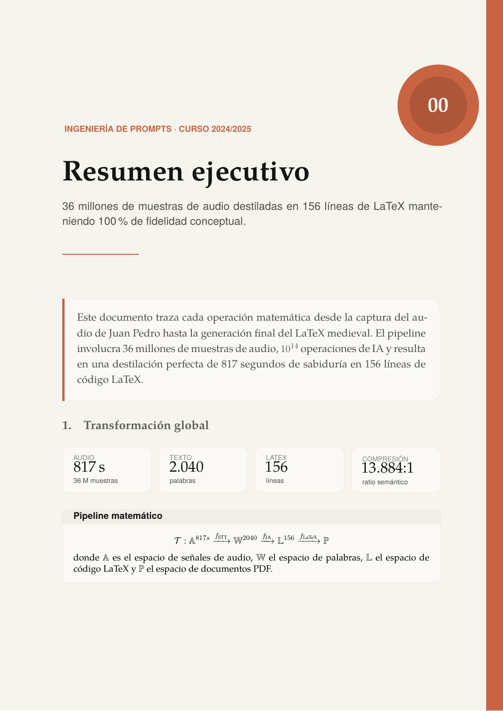</a>
<sub><b>Trazabilidad</b> · KPI cards + ClaudeCard con fórmula de pipeline.
<a href="docs/preview/pdf/trazabilidad-juan-pedro.pdf">📄 PDF</a></sub>
</td>
<td width="33%" valign="top">
<a href="docs/preview/pdf/interpolacion-codigo.pdf">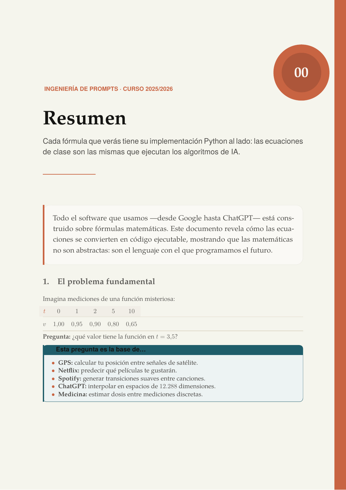</a>
<sub><b>Interpolación</b> · ClaudeCode Python + ClaudeCard de fórmula.
<a href="docs/preview/pdf/interpolacion-codigo.pdf">📄 PDF</a></sub>
</td>
<td width="33%" valign="top">
<a href="docs/preview/pdf/egarch-codigo-formula.pdf">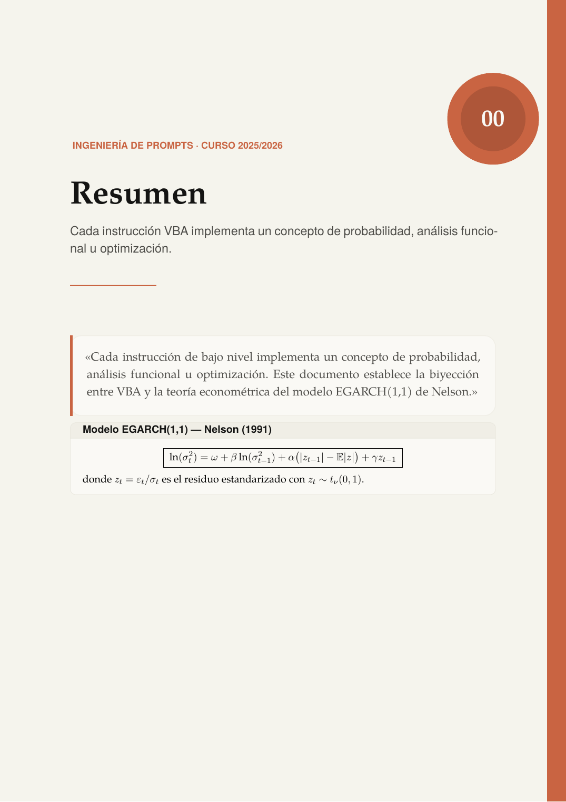</a>
<sub><b>EGARCH</b> · ClaudeCode VBA + ClaudeCard ecuación Nelson.
<a href="docs/preview/pdf/egarch-codigo-formula.pdf">📄 PDF</a></sub>
</td>
</tr>
<tr>
<td width="33%" valign="top">
<a href="docs/preview/pdf/cfc-redes-neuronales.pdf">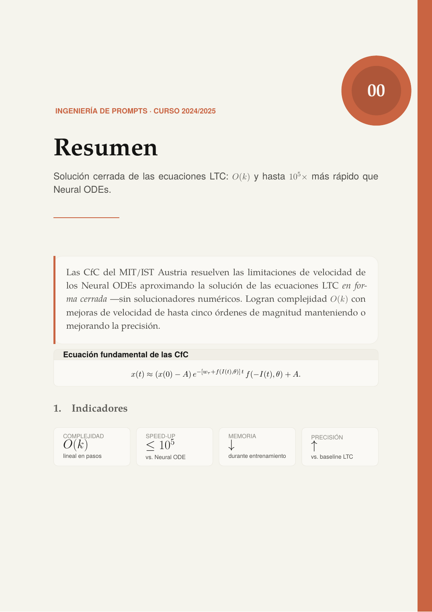</a>
<sub><b>CfC</b> · KPI cards + ClaudeCard ecuación CfC.
<a href="docs/preview/pdf/cfc-redes-neuronales.pdf">📄 PDF</a></sub>
</td>
<td width="33%" valign="top">
<a href="docs/preview/pdf/la-parte-principal.pdf">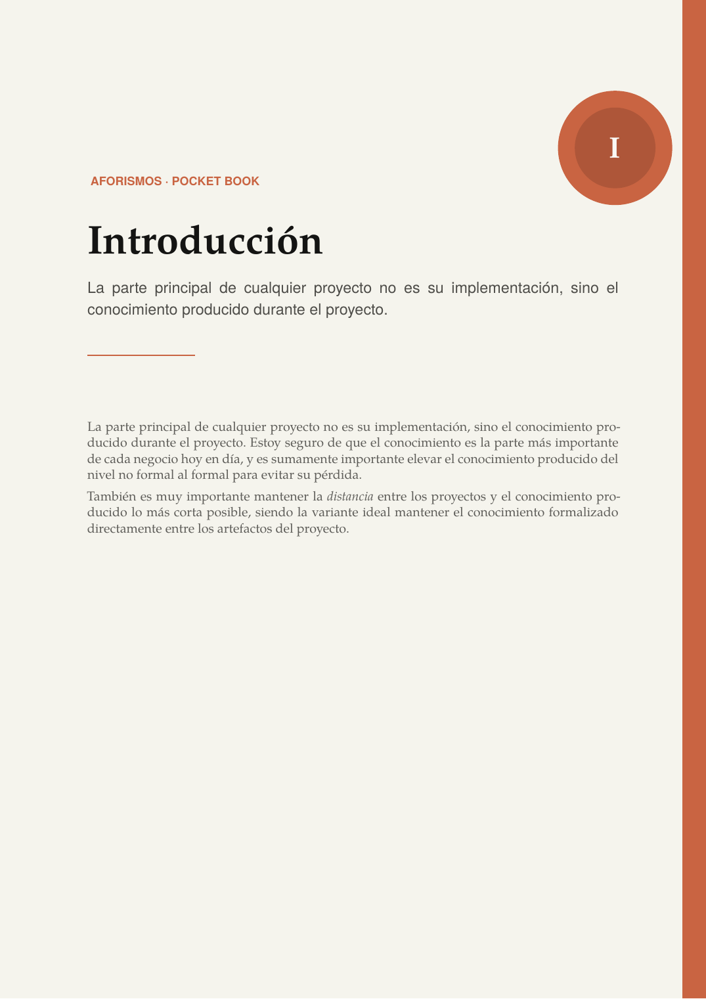</a>
<sub><b>La parte principal</b> · 5 ChapterPages con numeración romana.
<a href="docs/preview/pdf/la-parte-principal.pdf">📄 PDF</a></sub>
</td>
<td width="33%" valign="top">
<a href="docs/preview/pdf/uned-superficie-cilindrica.pdf">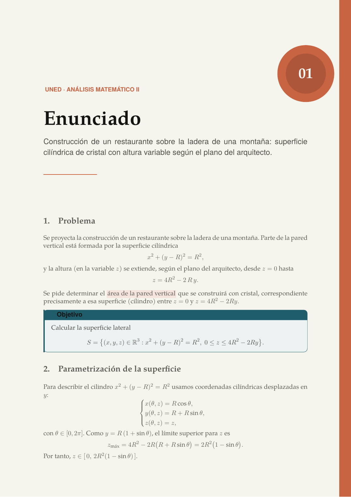</a>
<sub><b>UNED</b> · Info/Tip/Check con resultado $4\pi R^3$.
<a href="docs/preview/pdf/uned-superficie-cilindrica.pdf">📄 PDF</a></sub>
</td>
</tr>
</table>

## Inicio rápido

```bash
git clone https://github.com/<tu-usuario>/claudeeditorial-latex.git
cd claudeeditorial-latex

# Compilación recomendada (latexmk gestiona pasadas y biber)
latexmk main.tex

# Alternativa Windows / PowerShell
.\scripts\build.ps1 main.tex
```

El PDF se genera en `build/main.pdf`. Para empezar tu propio documento, copia
[`template.tex`](template.tex) y reescribe los metadatos:

```tex
\documentclass{claudeeditorial}

\renewcommand{\DocKicker}{Tu sección}
\renewcommand{\DocTitle}{Título del documento}
\renewcommand{\DocSubtitle}{Subtítulo claro y editorial}
\renewcommand{\DocAuthor}{Tu nombre}
\renewcommand{\DocRole}{Rol o equipo}
\renewcommand{\DocRef}{DOC-001}

\ClaudeRunningHeader

\begin{document}
\BodyCopy
\ClaudeCover

\begin{claudehero}
\ClaudeLead{Resumen ejecutivo del documento.}
\end{claudehero}

\section{Cuerpo}
Contenido…

\end{document}
```

## Overleaf

Todo lo necesario para compilar viaja con el repositorio: la clase
`claudeeditorial.cls`, el `latexmkrc`, `bibliography/references.bib`
y los siete documentos de la galería.

**Para abrir directamente en Overleaf:**

1. Descarga el ZIP del repo desde GitHub: *Code → Download ZIP*.
2. Entra en [overleaf.com](https://www.overleaf.com), pulsa
   **New Project → Upload Project** y suelta el ZIP.
3. En *Menu → Compiler* selecciona **XeLaTeX**.
4. Pulsa **Recompile** sobre cualquiera de los `.tex` (main, examples
   o aphorisms).

> Atajo con badge: cuando el repositorio esté publicado, el botón
> [](https://www.overleaf.com/docs?snip_uri=https://github.com/MevakeshEmetGPT/claudeeditorial-latex/archive/refs/heads/main.zip)
> abre el ZIP directamente en un proyecto nuevo de Overleaf
> (sustituye `MevakeshEmetGPT/claudeeditorial-latex` por tu fork si
> haces uno propio).

**Notas Overleaf-específicas:**

- Overleaf usa TeX Live full, así que **TeX Gyre Pagella, TeX Gyre
  Heros, Latin Modern Mono y todos los paquetes** que requiere la
  clase (`tcolorbox`, `tikz`, `cleveref`, `fvextra`, `biblatex`, …)
  están disponibles sin instalar nada.
- Las fuentes se cargan **por filename OTF** (`texgyrepagella-regular.otf`),
  no por nombre de sistema. Esto evita el típico error
  *«TeX Gyre Pagella cannot be found»* en Overleaf y MiKTeX.
- Para `main.tex` la bibliografía requiere Biber: en Overleaf está
  activado por defecto cuando detecta `\addbibresource{...}`.
- Si vas a compilar `examples/research-paper.tex` o cualquiera de
  los aforismos sueltos, marca el `.tex` correspondiente como
  *Main document* en el menú.

## Estructura del repositorio

```
claudeeditorial-latex/
├── claudeeditorial.cls         # Clase principal (≈ 1.700 líneas)
├── main.tex                    # Documento maestro (con biblatex/biber)
├── template.tex                # Punto de partida mínimo
├── standalone-template.tex     # Variante autocontenida sobre `article`
├── latexmkrc                   # Build reproducible vía latexmk
├── examples/
│   ├── showcase.tex            # Catálogo visual de componentes
│   ├── project-daybook.tex     # Diario de ingeniería de proyectos
│   ├── technical-showcase.tex  # Código, SQL, tablas, UML/ER, consola
│   ├── lorem-all-cases.tex     # Prueba integral (14 páginas, todo el sistema)
│   └── research-paper.tex      # Working paper SIAM-style: theorems, proofs, MSC
├── aphorisms/                  # Obras del autor portadas a claudeeditorial
│   ├── la-parte-principal.tex
│   ├── trazabilidad-juan-pedro.tex
│   ├── interpolacion-codigo.tex
│   ├── egarch-codigo-formula.tex
│   ├── cfc-redes-neuronales.tex
│   ├── erasmus-elogio-locura.tex
│   └── uned-superficie-cilindrica.tex
├── bibliography/
│   └── references.bib          # Bibliografía de ejemplo
├── tokens/
│   └── claude-editorial.css    # Tokens equivalentes para web/design systems
├── docs/
│   ├── ARCHITECTURE.md         # Estructura del repo y responsabilidades
│   ├── COMPONENTS.md           # Inventario completo de macros y entornos
│   ├── BEST_PRACTICES.md       # Reglas LaTeX y criterio editorial
│   ├── PROJECT_ENGINEERING.md  # Flujo de uso para documento diario
│   ├── REFERENCE_MAP.md        # Cómo se tradujo la inspiración a macros propias
│   ├── DESIGN_NOTES.md         # Traducción del estilo visual al PDF
│   └── preview/                # PDFs y PNGs pre-renderizados (galería)
├── scripts/
│   ├── build.ps1               # Build simple en Windows / PowerShell
│   └── clean.ps1               # Limpieza de archivos auxiliares
├── CHANGELOG.md
├── CONTRIBUTING.md
└── LICENSE                     # Unlicense — dominio público
```

## Requisitos

| Componente | Mínimo recomendado | Notas |
|---|---|---|
| Distribución TeX | TeX Live ≥ 2022, MiKTeX ≥ 22, MacTeX ≥ 2022 | Necesaria para `xelatex` y los paquetes listados abajo. |
| Motor | **XeLaTeX** | Requerido por `fontspec`. LuaLaTeX también funciona. |
| Bibliografía | Biber | Solo si compilas `main.tex` (usa `biblatex` con `backend=biber`). |
| Latexmk | Opcional pero recomendado | Gestiona automáticamente pasadas múltiples y biber. |

### Fuentes

La clase carga **TeX Gyre Pagella** (display/serif), **TeX Gyre Heros**
(UI/sans) y **Latin Modern Mono** (código) **por nombre de archivo OTF**, no
por nombre de sistema. Esto evita depender de la caché de fuentes del SO y
hace que la plantilla compile igual en MiKTeX, TeX Live y MacTeX sin instalar
nada en el sistema operativo.

### Dependencias LaTeX

`fontspec`, `xcolor`, `tikz`, `tcolorbox` (con librerías `breakable`,
`skins`, `raster`, `most`, `listings`, `documentation`), `booktabs`,
`tabularx`, `array`, `colortbl`, `fancyvrb`, `fvextra`, `listings`,
`hyperref`, `geometry`, `fancyhdr`, `setspace`, `microtype`, `enumitem`,
`marginnote`, `lastpage`, `csquotes`, `biblatex` (solo `main.tex`),
`babel`, `newunicodechar`. Todas vienen con TeX Live full y MiKTeX
"complete"; MiKTeX también las instala bajo demanda.

## Compilar los ejemplos

```bash
# Documento maestro con bibliografía (latexmk gestiona biber)
latexmk main.tex

# Ejemplos sin bibliografía (xelatex puro)
xelatex -output-directory=build examples/showcase.tex
xelatex -output-directory=build examples/project-daybook.tex
xelatex -output-directory=build examples/technical-showcase.tex
xelatex -output-directory=build examples/lorem-all-cases.tex
```

En PowerShell:

```powershell
.\scripts\build.ps1 main.tex
.\scripts\build.ps1 examples\showcase.tex
.\scripts\build.ps1 examples\project-daybook.tex
.\scripts\build.ps1 examples\technical-showcase.tex
.\scripts\build.ps1 examples\lorem-all-cases.tex
```

| Ejemplo | Pági­nas | Qué muestra |
|---|---:|---|
| [`main.tex`](main.tex) | 5 | Documento maestro: portada, TOC, capítulo, KPI, ADR, riesgos, código, bibliografía. |
| [`template.tex`](template.tex) | 3 | Plantilla mínima con cover, hero, decisión y checklist. |
| [`examples/showcase.tex`](examples/showcase.tex) | 6 | Catálogo visual: badges, iconos, glosario, citas, comparaciones. |
| [`examples/project-daybook.tex`](examples/project-daybook.tex) | 4 | Diario operativo: KPI, ADR, riesgos, evidencia técnica, diagrama. |
| [`examples/technical-showcase.tex`](examples/technical-showcase.tex) | 4 | Bloques de código (12+ lenguajes), tablas técnicas, UML/ER. |
| [`examples/lorem-all-cases.tex`](examples/lorem-all-cases.tex) | 14 | Prueba integral con casi todos los componentes y todas las cajas. |
| [`examples/research-paper.tex`](examples/research-paper.tex) | 6 | Working paper SIAM-style: portada de paper, abstract, keywords, MSC, theorems en castellano e inglés, demostraciones, `\cref`. |
| [`standalone-template.tex`](standalone-template.tex) | 7 | Variante autocontenida sobre `\documentclass{article}`. |

## Anatomía de un documento

```tex
\documentclass{claudeeditorial}              % 1. Clase

\renewcommand{\DocTitle}{Mi informe}         % 2. Metadatos del documento
\renewcommand{\DocSubtitle}{…}
\renewcommand{\DocAuthor}{Equipo}
\renewcommand{\DocRef}{DOC-001}

\renewcommand{\ProjectName}{…}               % 3. Metadatos del proyecto
\renewcommand{\ProjectStatus}{Activo}

\hypersetup{pdftitle={Mi informe}}           % 4. Metadatos del PDF

\ClaudeRunningHeader                          % 5. Header/footer global

\begin{document}
\BodyCopy                                     % 6. Color base del cuerpo
\ClaudeCover                                  % 7. Portada
\tableofcontents \clearpage

\ClaudeChapterPage{01}{Título}{Subtítulo}    % 8. Apertura de capítulo
\ClaudeProjectHeader{…}{…}{\today}{Activo}   % 9. Cabecera operativa

\begin{claudehero}                            % 10. Resumen ejecutivo
\ClaudeLead{…}
\end{claudehero}

\ClaudeDecisionRecord[Activa]                 % 11. Registro de decisión
  {ADR-001 · Título}
  {Contexto}{Decisión}{Consecuencia}

\begin{ClaudeTable}{@{}lL L l@{}}             % 12. Tabla con columnas L/Y
\ClaudeTableHeader Riesgo & Impacto & Mitigación & Estado \\
\toprule
\ClaudeRiskRow{R-001}{…}{…}{\StatusOpen}
\bottomrule
\end{ClaudeTable}

\begin{ClaudeCode}[title={Validación}]{SQL}   % 13. Código numerado
SELECT …;
\end{ClaudeCode}

\ClaudeSignature{\DocAuthor}{\DocRole}        % 14. Firma de cierre
\end{document}
```

## Catálogo de componentes

Vista resumida. Inventario completo en [`docs/COMPONENTS.md`](docs/COMPONENTS.md).

### Estructura editorial
`\ClaudeCover` · `\ClaudeChapterPage` · `\ClaudeProjectHeader` ·
`\ClaudeRunningHeader` · `\ClaudeBanner` · `\ClaudeSignature` ·
`\CornerRibbon`

### Cajas semánticas (con título opcional)
`ClaudeInfo` · `ClaudeTip` · `ClaudeWarning` · `ClaudeCritical` ·
`ClaudeCheck` · `ClaudeQuestion` · `ClaudeCard` · `ClaudeDiagram` ·
`ClaudeOutput` · `ClaudeConsole`

### Métricas y badges
`\KPICard{label}{valor}{trend}` · `\BigStat[Δ]{kicker}{valor}{label}` ·
`\ClaudeStat{label}{valor}{detalle}` · `\ClaudeBadge[color]{texto}` ·
`\Tag` · `\Highlight` · `\StatusOpen` · `\StatusWIP` · `\StatusDone` ·
`\SevCritical` · `\SevHigh` · `\SevMedium` · `\SevLow`

### Decisión y operación
`\ClaudeDecisionRecord[estado]{título}{contexto}{decisión}{consecuencia}` ·
`ClaudeActionList` + `\ClaudeActionItem` · `\ClaudeRiskRow` ·
`\ClaudeTimelineItem`

### Tablas
`ClaudeTable{column-spec}` · `\ClaudeTableHeader` ·
columnas `L` (left ragged) · `R` (right ragged) · `C` (centered) ·
`Y` (justified narrow) · `P{w}` · `M{w}`

### Código y consola
`ClaudeCode[title={…}]{lang}` · `ClaudeConsole` · `ClaudeOutput` ·
`\CodeInline{…}` · `\SQLTerm{…}` ·
lenguajes preconfigurados: SQL · JavaScript · TypeScript · JSON · CSS ·
HTML · XML · VBA · Java · C · C++ · C#

### Diagramas UML
`\ClaudeUMLClass{nombre}{atributos}{métodos}` ·
`\ClaudeUMLInterface` ·
`\ClaudeUMLRelation[estilo]{A}{B}[etiqueta]` ·
estilos: `claude uml relation` · `claude uml inherit` · `claude uml dependency`

### Diagramas ER
`\ClaudeEREntity` · `\ClaudeERWeakEntity` · `\ClaudeERAttribute` ·
`\ClaudeERRelationship` · `\ClaudeERIsa` ·
`\ClaudeEROneToMany` · `\ClaudeERManyToOne` · `\ClaudeERManyToMany` ·
`\ClaudeKey` · `\ClaudeWeakKey`

### Compatibilidad Pandoc
Entornos `Highlighting` y `Shaded` y todos los tokens `\KeywordTok`,
`\StringTok`, `\CommentTok`, `\OperatorTok`, … están definidos. Puedes
renderizar directamente la salida de `pandoc -t latex --listings=false`.

## Soporte matemático y paper cover

Pensado para working papers SIAM-style, cuadernos de investigación y
borradores de paper formal.

### Theorem-like (castellano · inglés, contador compartido)

`teorema` · `proposicion` · `lema` · `corolario` · `definicion` ·
`ejemplo` · `axioma` · `conjetura` · `observacion` · `nota`

`theorem` · `proposition` · `lemma` · `corollary` · `definition` ·
`example` · `conjecture` · `axiom` · `remark` · `note`

Todos comparten contador con `[teorema]`, así un teorema en español y un
*theorem* en inglés se numeran 1, 2, 3 en la misma serie. La cabecera de
cada uno usa **terracota** para sentencias formales y **gris cálido**
para `remark`/`nota`/`observacion`. La demostración (`\begin{proof}`)
cierra con un **■** terracota.

### Macros matemáticas reutilizables

```tex
\R \N \Z \Q \C \F            % conjuntos en pizarra
\E \Prob \Var \Cov \Corr     % probabilidad
\Bias \MSE \rank \tr \diag   % estadística y álgebra lineal
\spn \im \sign \sgn          % operadores
\argmin \argmax              % con \DeclareMathOperator*

\abs{x} \norm{x} \inner{x,y} % autosizing (mathtools)
\set{...} \floor{...} \ceil{...}

\indicator{x>0} \dif x \eps  % indicador, diferencial, ε
\given                       % barra para condicionales
\vect{x} \mat{A}             % negrita
```

Todas con `\providecommand` para que NO sobrescriban definiciones
previas si tu paper ya las traía.

### Cross-references inteligentes

`cleveref` cargado con `[capitalize, noabbrev, nameinlink]`. Escribes
`\cref{thm:calibracion}` y obtienes *«Teorema 4.2»* (o *«ecs. (3.1)–(3.3)»*
si referencias varias) sin escribir el prefijo a mano.

### Portada de paper académico

```tex
\renewcommand{\PaperKeywords}{coeficiente AR; estimadores robustos; …}
\renewcommand{\PaperMSC}{60E15, 62G35, 65C60}
\PaperAuthor{Nombre Apellido}{Universidad de X}{nombre@uni.example}
\PaperAuthor{Otro Autor}{Otra institución}{otro@uni.example}

\begin{document}
\ClaudePaperCover{%
  Texto del abstract en un párrafo. Hipótesis, contribución y contexto.
  6–12 líneas. Sin LaTeX dentro a menos que sea necesario.}
```

Renderiza una portada con kicker, título display, banda terracota,
bloque de autores con afiliación y email, fecha, referencia, abstract
en caja marfil y los campos *Keywords* + *AMS subject classification*.

### Bonus: cubierta editorial alternativa

`\ClaudeCoverEditorial` es una variante de cubierta con composición tipo
revista científica (banda completa terracota, ornamento tipográfico de
fondo, masthead inferior con autor / fecha / referencia / rol / estado /
fase). Usable en cualquier `.tex` que ya use `\ClaudeCover`.

## Personalizar metadatos

Cada `\renewcommand` controla un campo del sistema visual. Todos tienen
valor por defecto, así que solo redefines los que necesitas.

| Comando | Aparece en |
|---|---|
| `\DocKicker` | Top de la portada y de cada apertura de capítulo. |
| `\DocTitle` | Portada. |
| `\DocSubtitle` | Portada. |
| `\DocAuthor`, `\DocRole`, `\DocDate` | Pie de portada y firma. |
| `\DocRef` | Esquina inferior izquierda (referencia auditable). |
| `\DocFooter` | Pie de página global. |
| `\ProjectName`, `\ProjectPhase`, `\ProjectOwner`, `\ProjectStatus` | `\ClaudeProjectHeader`. |

## Sistema de tokens

La paleta y la tipografía están materializadas también como tokens CSS en
[`tokens/claude-editorial.css`](tokens/claude-editorial.css), de modo que
puedes mantener un único design system entre tus PDFs y tus interfaces web.

| Token PDF | HEX | Uso |
|---|---|---|
| `claudeParchment` | `#F5F4ED` | Fondo de portada y bandas. |
| `claudeIvory` | `#FAF9F5` | Cajas y campos de cuerpo. |
| `claudeTerracotta` | `#C96442` | Acento (kicker, ADR, marcador de capítulo). |
| `claudeInk` | `#141413` | Títulos display. |
| `claudeWarmText` | `#4D4C48` | Texto auxiliar y subtítulos. |
| `claudeStone` | `#87867F` | Etiquetas, kickers en mayúscula. |
| `claudeBorder` | `#E8E6DC` | Bordes neutros suaves. |

Existe también la **paleta PulseID** (`pulseIdentidad`,
`pulseContinuidad`, `pulseDecision`, `pulseConformal`) para extensiones
técnicas — ver [`docs/DESIGN_NOTES.md`](docs/DESIGN_NOTES.md).

## Principios de diseño

1. **La clase define sistema visual, no contenido.** Los `.tex` aportan
   metadatos, estructura y bibliografía; el `.cls` aporta tipografía,
   color y composición.
2. **El acento terracota se usa con disciplina.** Reservado para
   decisiones, marcadores de capítulo y kickers — nunca como decoración.
3. **Macros públicas con prefijo `Claude`.** Los entornos *legacy* en
   minúscula (`claudenote`, `claudehero`) se conservan por ergonomía.
4. **Sin paquetes vendorizados.** Las ideas de inspiración se tradujeron
   a macros originales con licencia limpia.
5. **Reproducible y portable.** XeLaTeX + fuentes por filename → mismo
   PDF en MiKTeX, TeX Live y MacTeX, sin instalar fuentes en el sistema.
6. **Tablas, diagramas y código deben ser legibles en PDF.**
   Si una pieza queda apretada, el documento está mal compuesto, no la
   clase.

## Documentación adicional

| Archivo | Propósito |
|---|---|
| [`docs/ARCHITECTURE.md`](docs/ARCHITECTURE.md) | Estructura del repo y responsabilidades de cada archivo. |
| [`docs/COMPONENTS.md`](docs/COMPONENTS.md) | Inventario completo de macros y entornos. |
| [`docs/BEST_PRACTICES.md`](docs/BEST_PRACTICES.md) | Reglas LaTeX y criterio editorial. |
| [`docs/PROJECT_ENGINEERING.md`](docs/PROJECT_ENGINEERING.md) | Flujo de uso para documento diario de ingeniería. |
| [`docs/REFERENCE_MAP.md`](docs/REFERENCE_MAP.md) | Cómo se tradujeron los recursos LaTeX de inspiración. |
| [`docs/DESIGN_NOTES.md`](docs/DESIGN_NOTES.md) | Traducción del estilo visual al PDF. |
| [`docs/preview/`](docs/preview/) | PDFs y PNGs pre-renderizados de la galería. |

## Solución de problemas

<details>
<summary><b>«The font &quot;TeX Gyre Pagella&quot; cannot be found»</b></summary>

La clase carga las fuentes por **filename** (`texgyrepagella-regular.otf`,
etc.). Esos archivos vienen con TeX Live y MiKTeX. Si MiKTeX no los ha
instalado todavía, ejecuta:

```powershell
mpm --install=tex-gyre
mpm --install=lm
```

o en TeX Live:

```bash
tlmgr install tex-gyre lm
```
</details>

<details>
<summary><b>«File ended while scanning use of \TX@get@body»</b></summary>

Causa típica: envolver `tabularx` con `\NewDocumentEnvironment`. La clase
ya define `ClaudeTable` con `\newenvironment`, que es la forma correcta.
Si añades tablas propias, usa también `\newenvironment` o invoca
`tabularx` directamente.
</details>

<details>
<summary><b>«Misplaced \noalign» en cabeceras de tabla</b></summary>

`\rowcolor` requiere expansión transparente. Si defines macros que
emiten `\rowcolor` dentro de una tabla, usa `\newcommand` (no
`\NewDocumentCommand`) — xparse protege la expansión y rompe la
detección de contexto de fila.
</details>

<details>
<summary><b>«Package keyval Error: breaklines undefined» en bloques Pandoc</b></summary>

`fancyvrb` clásico no soporta `breaklines`. La clase carga `fvextra`
después de `fancyvrb`, que añade ese key. Si tu distro no lo tiene:

```bash
tlmgr install fvextra        # TeX Live
mpm --install=fvextra        # MiKTeX
```
</details>

<details>
<summary><b>«Reference 'LastPage' on page X undefined»</b></summary>

Es una advertencia, no un error: aparece en la primera pasada porque
el contador `LastPage` aún no está resuelto. Compila dos veces (o usa
`latexmk`) y desaparece.
</details>

## Contribuir

PRs y issues bienvenidos. Antes de proponer cambios revisa
[`CONTRIBUTING.md`](CONTRIBUTING.md). Reglas resumidas:

- No incluyas contenido privado, planificación real ni rutas locales.
- Macros públicas nuevas con prefijo `Claude`.
- Documenta cada familia nueva en [`docs/COMPONENTS.md`](docs/COMPONENTS.md).
- Si añades una dependencia LaTeX, justifícala.

## Licencia

[**Unlicense**](LICENSE) — dominio público. Puedes copiar, modificar,
vender, publicar y reutilizar el código sin pedir permiso y sin
atribución obligatoria.

## Proyecto no oficial

> Este es un proyecto independiente, **no afiliado a Anthropic ni a
> Claude**. El nombre y la inspiración visual hacen referencia al
> lenguaje de diseño público, pero el código es 100 % original y se
> publica bajo dominio público.
